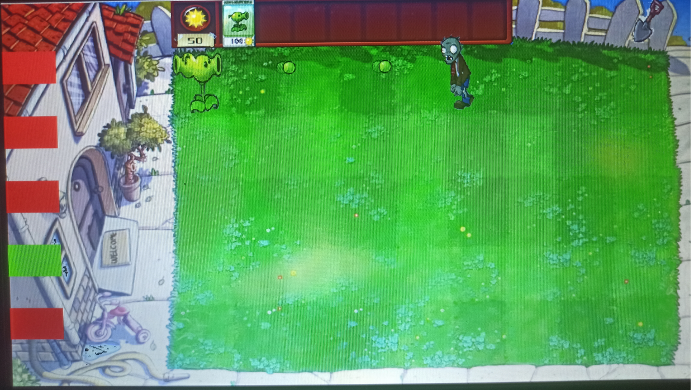
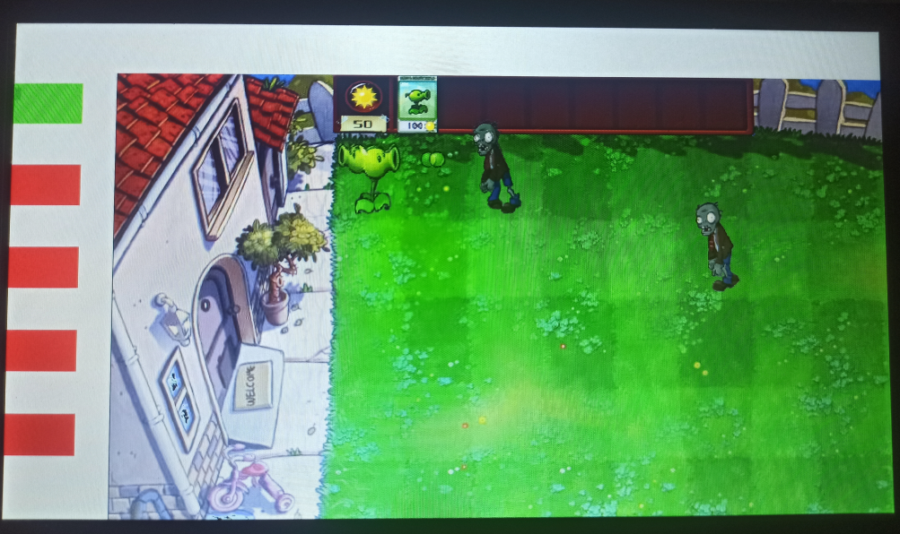
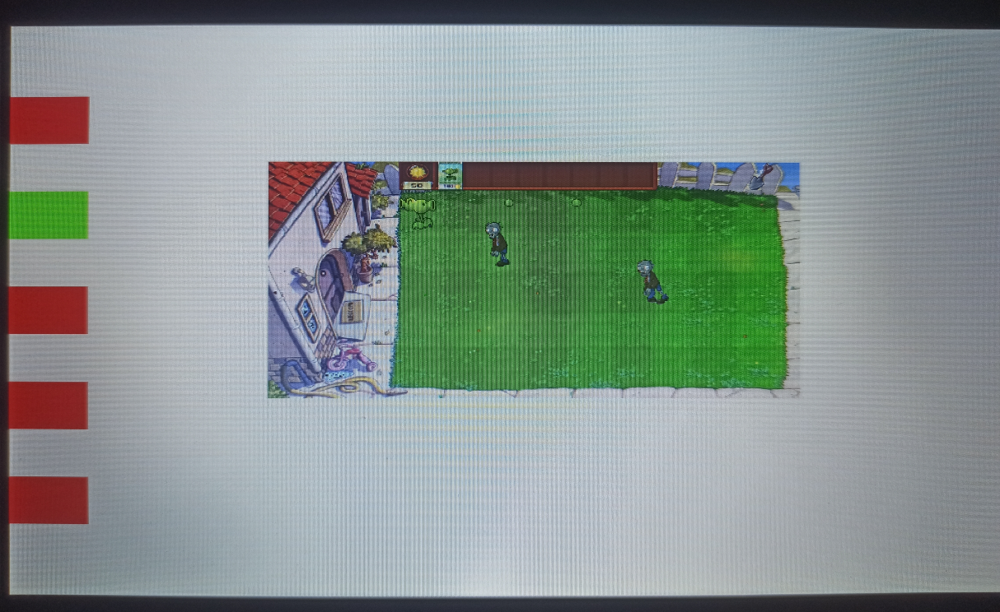
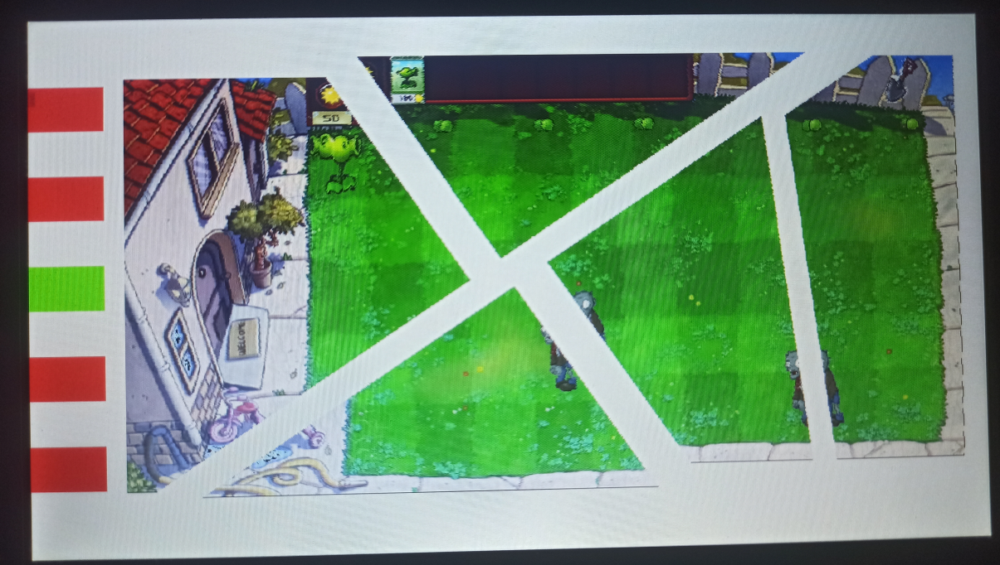
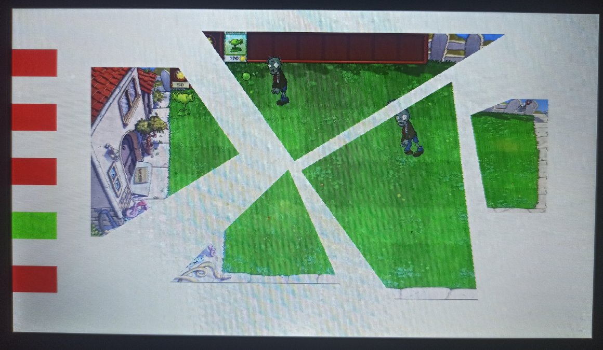
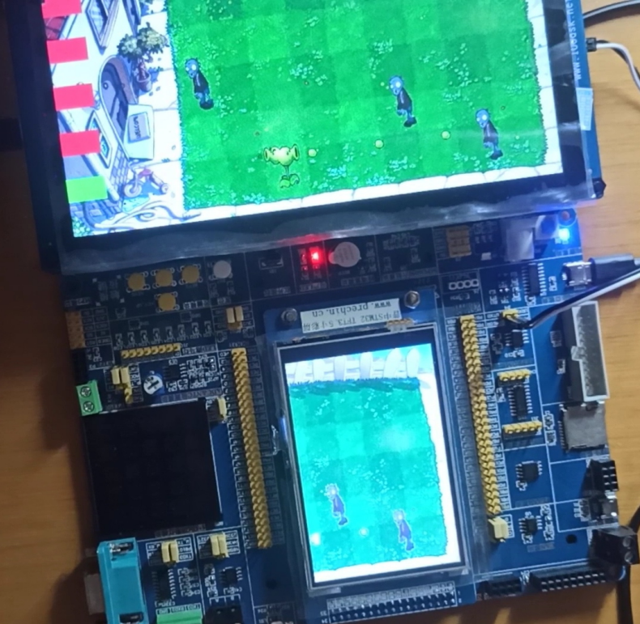
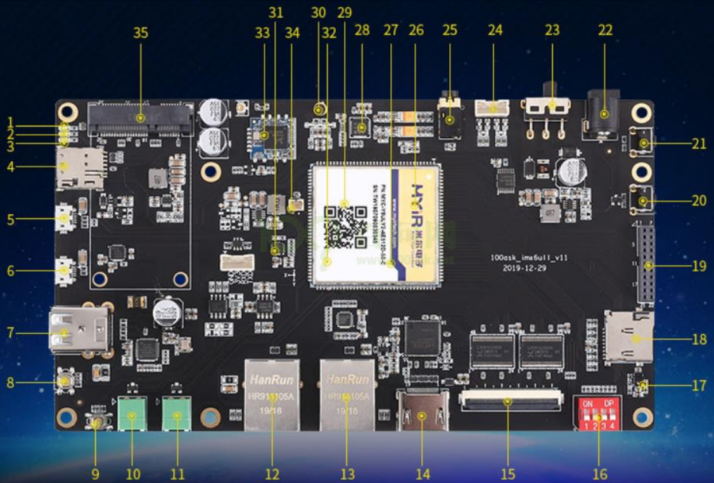
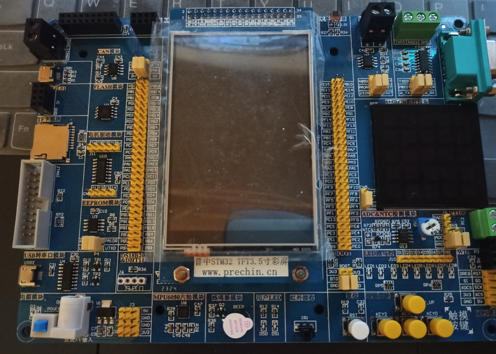

# 基于imx6ull的分屏功能
## 1.功能介绍
### 1.1 默认为启动一个植物大战僵尸的游戏
游戏实现比较简单，只做了一种植物和僵尸，可以拖放、铲除植物，没有阳光收集的功能。如下图，左侧有5个红色的按钮，对应5种不同模式，选择某种后变为绿色。第4个按钮是“游戏模式”，在该模式下，可以在屏幕上实现植物的拖放和铲除。

### 1.2 移动图像
该模式对应左侧第一个按钮，可以实现图像的任意移动，移动的过程不影响图像原本的动画过程，下面每个模式都是如此。

### 1.3缩放图像
该模式对应左侧第二个按钮，通过触摸屏幕上两点，实现图像纵向或横向的任意缩小和放大，缩放倍数无限制，但放大过大会造成一些卡顿

### 1.4切割图像
该模式对应左侧第四个按钮，在屏幕上触屏两点，两点形成的线段如果与图像相交，就会利用该线段分割对应的图像，如下图效果。每个分割后的图像块都是独立的对象，可以分割后再次分割。

上面4中模式为连续，可切换的，比如在分割后可以切换到缩放或移动模式，对分割后的对象进行操作，操作后又可以进行分割，无限制。且每个分割的对象都是可以进行游戏交互的，比如在按下第4个按钮后可以将植物从一个图像块拖到任意一个图形块放。

### 1.5映射图像
这个模式“虚假”地实现屏幕映射，将imx6ull上显示的图像的一部分在另一块屏幕上进行显示。如下图，按下第5个按钮后，主屏的右边一部分像素被“传输”到了另一块stm32f103驱动的显示屏上，并且运行不显得过于卡顿。在该模式下任可以用游戏交互，但不可以用图像移动、缩放和分割（可以切换，但那样stm32驱动屏幕停止显示，等待下一次切换回来）

## 2.硬件和硬件需求
- 主板是韦东山imx6ull开发板，配有lcd显示屏；
- imx6ull开发板的linux资源，官网可以获取：https://www.100ask.net/

- stn32f103板子，有lcd显示屏(565)
- stm32f103所需驱动：串口、显示屏、usb_msc、spi_flash、fatfs

## 3.操作过程
### 3.1 处理图片
- imx6ull可以直接使用24位位图，在相应的函数中可以处理，所以直接拷贝"./src/image/bmp2/game"到板子上
- stmf103受限于内存和显示屏格式要求，需要将相应的24位bmp图片处理，利用"./src/image/chage_bmp_size.py"更改图片大小，再用"./src/image/bmp_24_to_565.py"更改图片格式，只需将文件路径替换即可./src/image/bmp1/game"为处理好的图片。改好的文件通过USB_MSC下载到stm32f103的spiflash前面12M，MSC项目文件在"./src/stm32/USB_MSC"
### 3.2编译下载程序
- imx6ull开发板交叉编译和下载参考"./doc/嵌入式Linux应用开发完全手册V5.2_IMX6ULL_Pro开发板.pdf",源码位于"./src",利用makefile进行编译即可，程序需要链接静态库ts，需自行下载编译
- stm32f103程序在"./src/stm32/Object"，可以利用keil直接编译，烧录